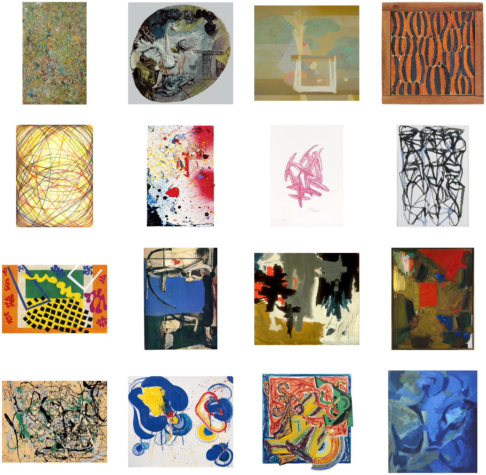
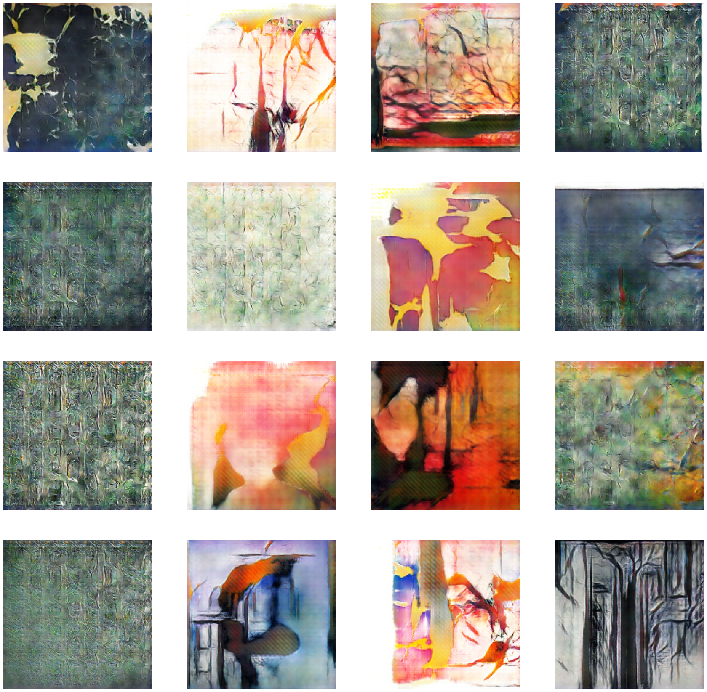

# DCGAN project with pytorch

The goal of this project is to create a DCGAN with pytorch tools.

I firsly try to generate numbers with mnist dataset and then I build more complex networks for abstract art generation.

## Dataset

[Abstract Art Gallery](https://www.kaggle.com/bryanb/abstract-art-gallery/code)

### Sample training

## Results

## Source

I was inspired by several examples:
- [Pytorch tutorials](https://pytorch.org/tutorials/beginner/dcgan_faces_tutorial.html)
- [Kaggle example](https://www.kaggle.com/algord/abstract-art-generator-dcgan)
- [Baptiste Pesquet handbook](https://www.bpesquet.fr/mlhandbook/algorithms/generative_adversarial_networks.html#introduction-and-basic-example)